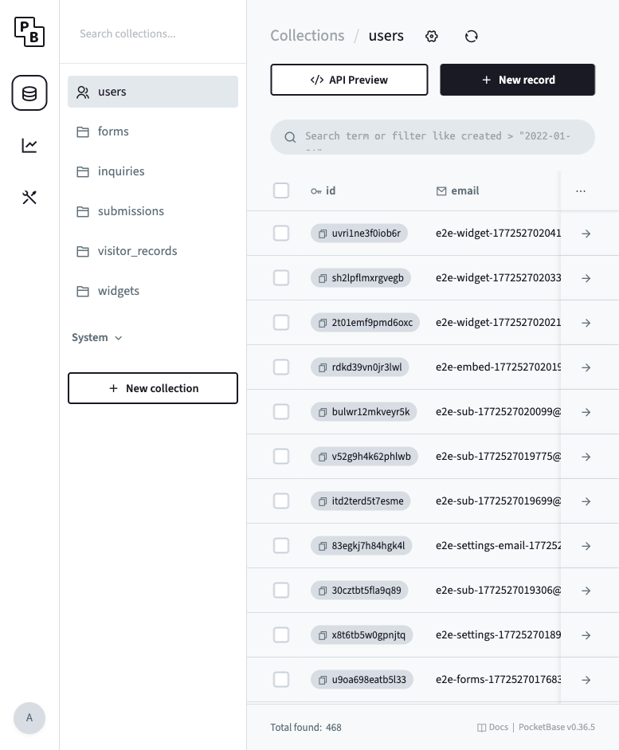
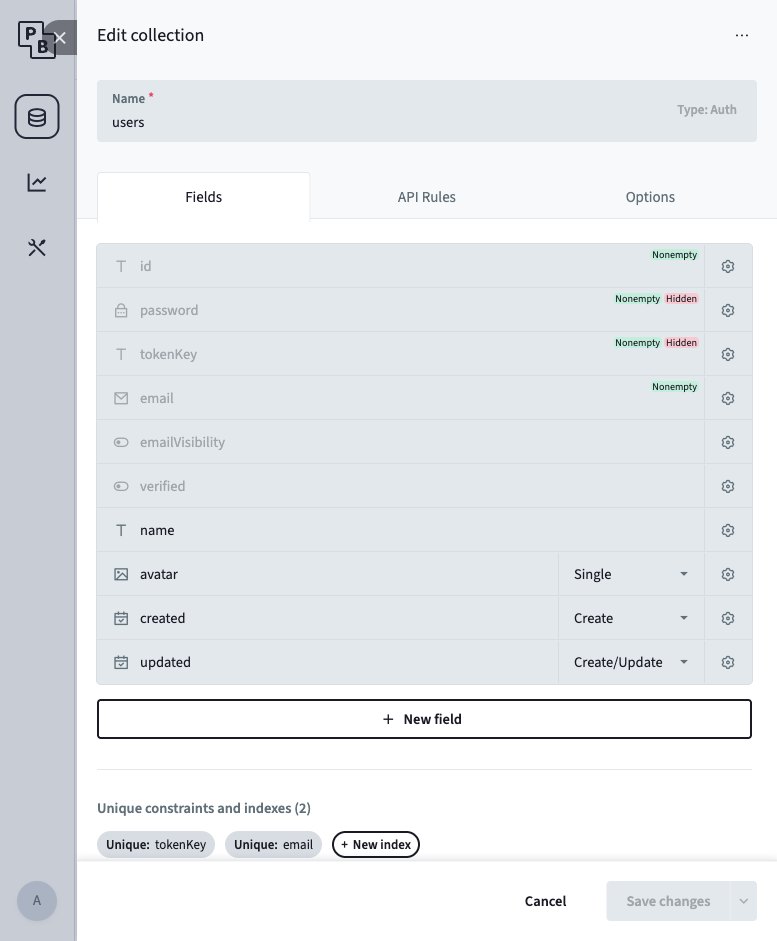
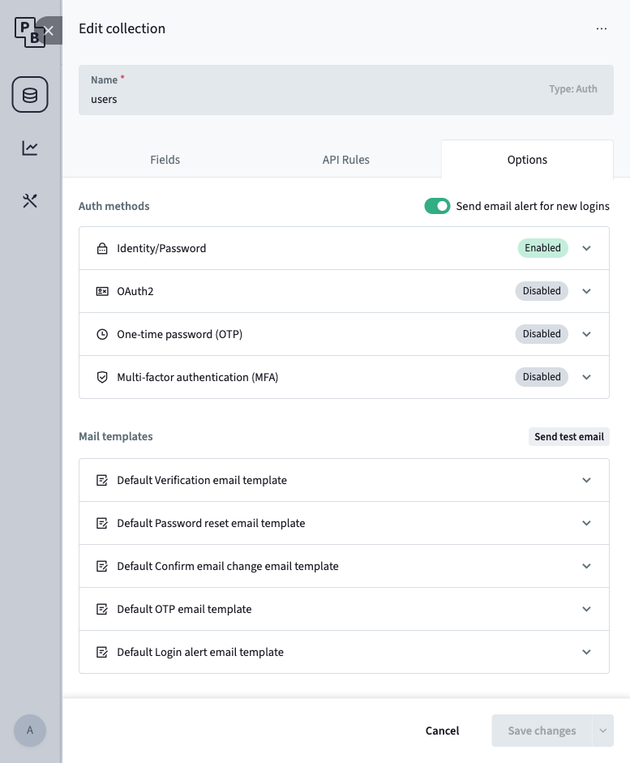
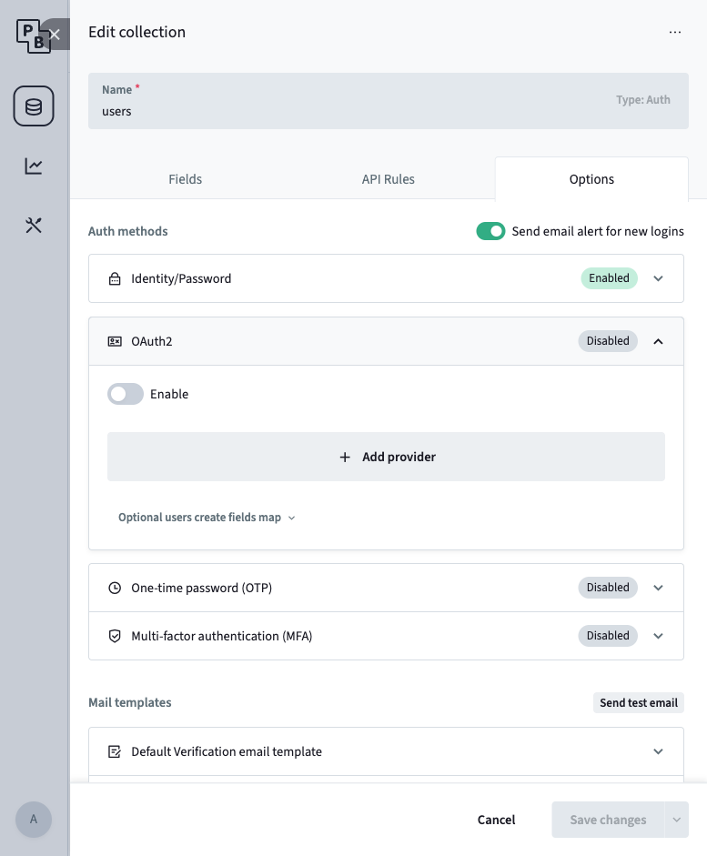
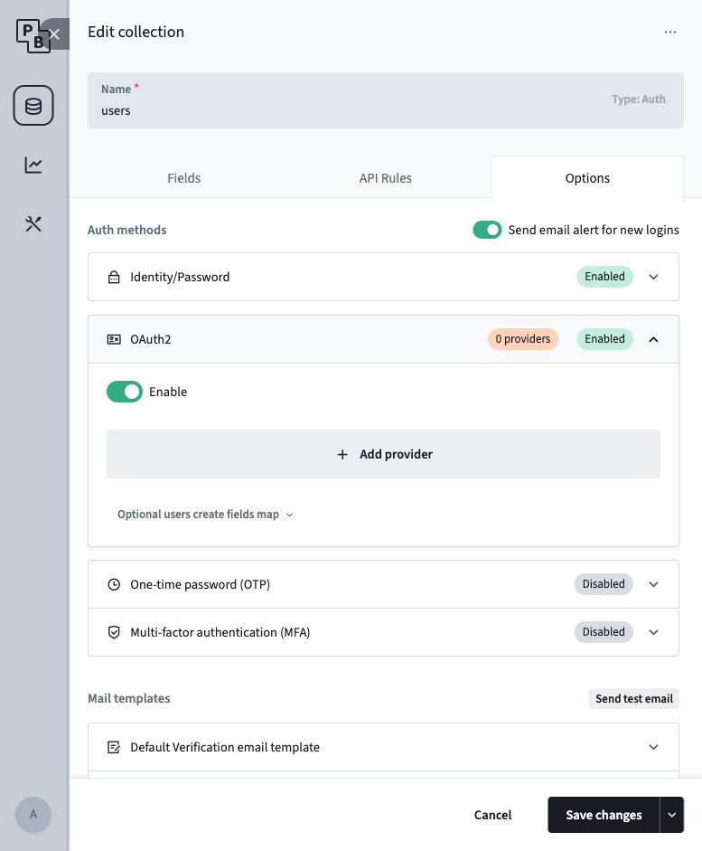
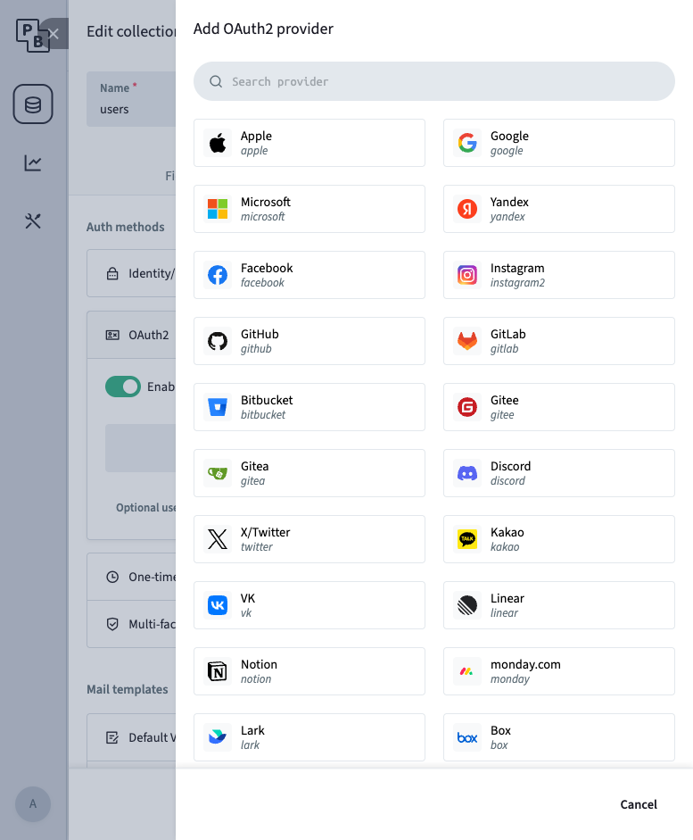
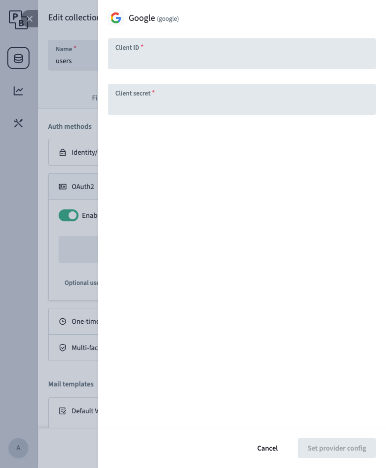
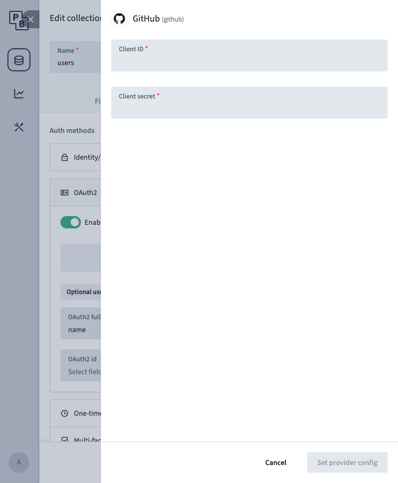
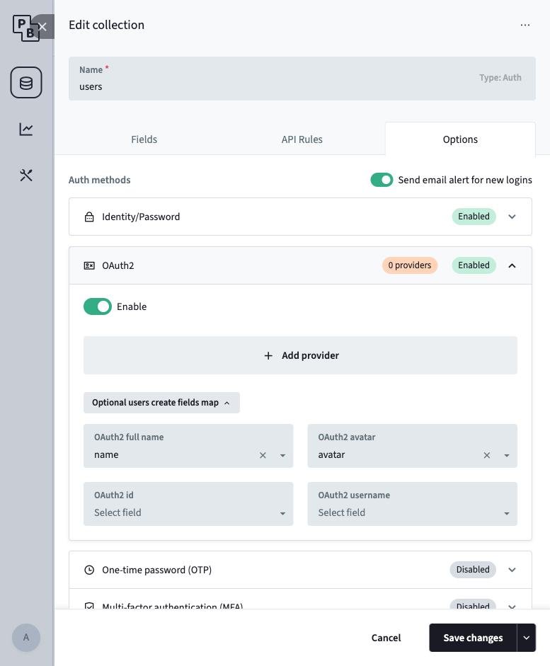

# OAuth Provider Configuration Guide

How to obtain Google / GitHub OAuth credentials and configure them in the PocketBase Admin UI.

> **Key point**: All three systems must share the same redirect URI.
>
> | System | Setting | Value (local) |
> |--------|---------|---------------|
> | Google Cloud Console | Authorized redirect URIs | `http://127.0.0.1:8090/api/oauth2-redirect` |
> | GitHub OAuth App | Authorization callback URL | `http://127.0.0.1:8090/api/oauth2-redirect` |
> | PocketBase | Auto-generated from server URL | `http://127.0.0.1:8090/api/oauth2-redirect` |
>
> Production: replace `http://127.0.0.1:8090` with your actual PocketBase domain (e.g. `https://pb.example.com`).

---

## 1. Google OAuth2

### 1.1 Configure the OAuth Consent Screen (first-time only)

1. Go to [Google Cloud Console](https://console.cloud.google.com/) and select (or create) your project.
2. Navigate to **Google Auth platform > Branding** (or legacy path: **APIs & Services > OAuth consent screen**).
   - If you see "Google Auth platform not configured yet", click **Get Started**.
3. Fill in **App Information**:
   - **App name**: e.g. `Form Handler`
   - **User support email**: select your email
4. Click **Next**.
5. Choose **Audience** (user type):
   - **Internal** — only your Google Workspace org (no verification needed)
   - **External** — any Google account (starts in Testing mode; limited to 100 test users until published)
6. Provide a **developer contact email** and click **Create**.
7. If External: go to **Audience** and add your test users' emails under "Test users".

### 1.2 Create OAuth Client ID

1. Navigate to **Google Auth platform > Clients** (or legacy: **APIs & Services > Credentials**).
2. Click **Create Client** (new UI) or **+ Create Credentials > OAuth client ID** (legacy).
3. **Application type**: `Web application`
4. **Name**: e.g. `Form Handler Dev`
5. **Authorized redirect URIs** — add:
   - `http://127.0.0.1:8090/api/oauth2-redirect` (local dev)
   - `https://pb.example.com/api/oauth2-redirect` (production, if applicable)
6. Click **Create**.
7. Copy the **Client ID** and **Client Secret** immediately (the secret is masked after you close this dialog).

### Notes

- `127.0.0.1` and `localhost` are treated as different hosts; use `127.0.0.1` to match PocketBase's default.
- The client secret IS required — PocketBase uses server-side code exchange, not a pure client-side flow.

---

## 2. GitHub OAuth App

### 2.1 Create OAuth App

1. Go to [GitHub > Settings > Developer settings > OAuth Apps](https://github.com/settings/developers).
2. Click **New OAuth App**.
3. Fill in:
   - **Application name**: e.g. `Form Handler Dev`
   - **Homepage URL**: `http://localhost:3000` (or your production URL)
   - **Authorization callback URL**: `http://127.0.0.1:8090/api/oauth2-redirect`
4. Click **Register application**.

### 2.2 Get Credentials

On the app settings page:

1. **Client ID** — displayed on the page, copy it.
2. **Client Secret** — click **Generate a new client secret**, copy the value immediately (shown only once).

### Notes

- GitHub OAuth Apps support only **one** callback URL per app. Use separate apps for dev and production.
- For users with private emails, PocketBase automatically requests the `user:email` scope.

---

## 3. PocketBase Admin UI Configuration

### 3.1 Enable OAuth2

1. Open PocketBase Admin UI: `http://127.0.0.1:8090/_/`
2. In the left sidebar, click the **users** collection.

   

3. Click the **gear icon** ("Edit collection") in the header.

   

4. Switch to the **Options** tab.

   

5. Expand the **OAuth2** section and toggle **Enable** to ON.

   

   

### 3.2 Add Google Provider

1. Click **+ Add provider**.

   

2. Select **Google** from the grid.
3. Paste:
   - **Client ID** — from Google Cloud Console (Step 1.2)
   - **Client secret** — from Google Cloud Console (Step 1.2)

   

4. Click **Set provider config**.

### 3.3 Add GitHub Provider

1. Click **+ Add provider** again.
2. Select **GitHub** from the grid.
3. Paste:
   - **Client ID** — from GitHub (Step 2.2)
   - **Client secret** — from GitHub (Step 2.2)

   

4. Click **Set provider config**.

### 3.4 Configure Field Mappings (optional but recommended)

Below the providers list, expand **"Optional users create fields map"**:

| OAuth2 field | Map to user field |
|--------------|-------------------|
| OAuth2 full name | `name` |
| OAuth2 avatar | `avatar` |



This auto-populates the user's display name and profile picture on first OAuth sign-in.

### 3.5 Save

Click **Save changes** at the bottom of the panel.

---

## 4. Verify

1. Start PocketBase and Next.js:
   ```bash
   # Terminal 1
   cd backend && ./pocketbase serve

   # Terminal 2
   cd frontend && npm run dev
   ```
2. Open `http://localhost:3000/login`.
3. You should see "Sign in with Google" and "Sign in with GitHub" buttons.
4. Click a button — a popup opens with the provider's consent screen.
5. Authorize — the popup closes and you land on the dashboard.

### Verify in Admin UI

- **users** collection: check that the new user record has `name` and `avatar` populated.
- **_externalAuths** collection: check that a record exists linking the user to the OAuth provider.

---

## Troubleshooting

| Issue | Solution |
|-------|----------|
| Popup blocked by browser | `authWithOAuth2()` must be called directly in a click handler, not inside an async callback |
| "Redirect URI mismatch" | The URI in the provider console must match exactly: `http://127.0.0.1:8090/api/oauth2-redirect` |
| Provider buttons don't appear | Verify the provider is enabled in PocketBase Admin UI with valid credentials, then hard-refresh the login page |
| Avatar not populated | Configure field mappings in PocketBase Admin UI (Step 3.4) |
| GitHub "email not found" | The GitHub account needs a public email, or the app must have `user:email` scope (PocketBase handles this automatically) |
| Google "Access denied" | If using External user type, add your email to the test users list (Step 1.1.7) |
